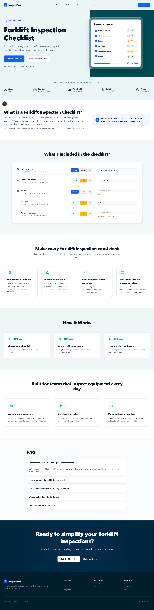

# 🏠 InspectPro — Property Inspection Landing Page

A modern, responsive landing page for **InspectPro**, a professional property inspection platform. Built with Next.js and designed to convert visitors into customers.

---

## 📸 Preview



---

## 🚀 Tech Stack

- **Framework**: [Next.js 15](https://nextjs.org/)
- **Language**: TypeScript
- **Styling**: CSS Modules / Tailwind CSS
- **Font**: Google Fonts

---

## ✨ Features

- 🏡 Hero section with strong call-to-action
- ✅ Benefits & features overview
- 📋 What's Included checklist cards
- 🔄 How It Works step-by-step flow
- 🏢 Use Cases for different property types
- 📞 CTA section with contact prompt
- 📱 Fully responsive design

---

## 🛠️ Getting Started

1. **Clone the repo** and install dependencies:

```bash
npm install
```

2. **Run the development server:**

```bash
npm run dev
```

3. Open [http://localhost:3000](http://localhost:3000) in your browser.

---

## 📁 Project Structure

```
src/
├── app/          # Next.js App Router pages
└── components/   # Reusable UI components
public/
└── screenshot.png  # Landing page preview
```

---

## 📦 Deployment

Deploy instantly on [Vercel](https://vercel.com):

[](https://vercel.com/new)
